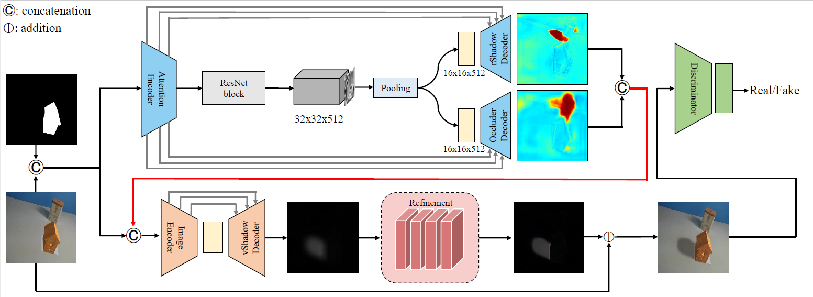
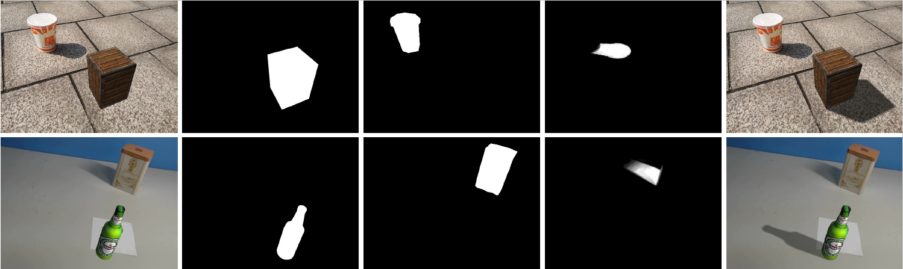
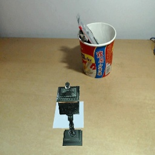

# ARShadowGAN

This is the TensorFlow implementation of the IEEE CVPR 2020 paper "ARShadowGAN: Shadow Generative Adversarial Network for Augmented Reality in Single Light Scenes". The overview of ARShadowGAN is shown below.


## Requirements:

* CUDA (9.0)
* cuDNN (7.4.1)
* tensorflow-gpu (1.12.0)
* opencv-python (4.1.1.26)
* numpy (1.16.5)
* python (3.5.4)

This code has been tested under Windows 10 and Ubuntu 16.04 successfully with all the requirements.

## Shadow-AR Dataset

Our Shadow-AR dataset is partially available. Download the file [Shadow-AR.zip](https://drive.google.com/drive/folders/17S9p56iMEd7_l5-ZbNjd7Z3KhiKmW0k_?usp=sharing) and unzip it. Supervised data samples are shown below.


Shadow-AR contains five kinds of images and corresponding images in different directories have the same name:
|Directory|Content|Role|
|-|-|-|
|noshadow|AR images without shadows of inserted virtual objects|Input|
|mask|Mask images of inserted virtual objects|Input|
|rshadow|Real-world shadow matting images|Intermediate output supervision|
|robject|Mask images of real-world shadows' occluders|Intermediate output supervision|
|shadow|AR images with plausible virtual object shadows|Target output supervision|

This current dataset configuration is used for ARShadowGAN training and evaluation. Images in directory "train/stage1/" are used for attention block training. Images in directory "train/stage2/" are used for generator and discriminator training. Images in "test/" are used for evaluation.

Shadow-AR dataset is free for non-commercial research. You can use it for other tasks, merge or re-split it as desired.

## Pre-trained Model

We provide the pre-trained model of TensorFlow PB format. Download the file [model.pb](https://drive.google.com/drive/folders/17S9p56iMEd7_l5-ZbNjd7Z3KhiKmW0k_?usp=sharing) and place it in directory "model/".

## Code

1. Run in terminal:
```bash
git clone https://github.com/ldq9526/ARShadowGAN.git
cd ARShadowGAN/
```

2. Download pre-trained model (model.pb), then place it in directory "model/".

3. Prepare image data containing input images and virtual object masks. Such as images in directory "data/":


4. Run in terminal:
```bash
python test.py
```
Generated attention maps and AR images with virtual object shadows will be saved in directory "output/".

To test with custom image data, modify test.py line 13 (data_root = ....) and replace images in directories "noshadow/" and "mask/".

## Note

Images of Shadow-AR dataset are of size 640x480. Images input to ARShadowGAN should be resized to 256x256.

## Citation
If you use the code or Shadow-AR dataset in your own research, please cite:
```
@InProceedings{liu2020,  
  title = {ARShadowGAN: Shadow Generative Adversarial Network for Augmented Reality in Single Light Scenes},
  author = {Liu, Daquan and Long, Chengjiang and Zhang, Hongpan and Yu, Hanning and Dong, Xinzhi and Xiao, Chunxia},
  booktitle = {The IEEE Conference on Computer Vision and Pattern Recognition (CVPR)},
  month = {June},
  year = {2020}
}
```
